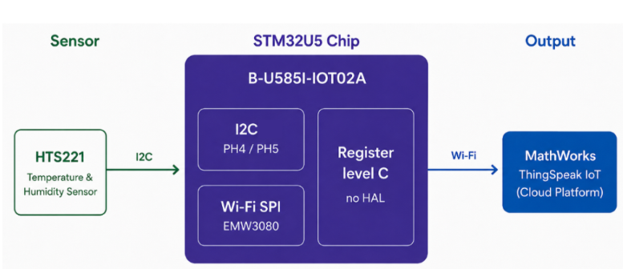
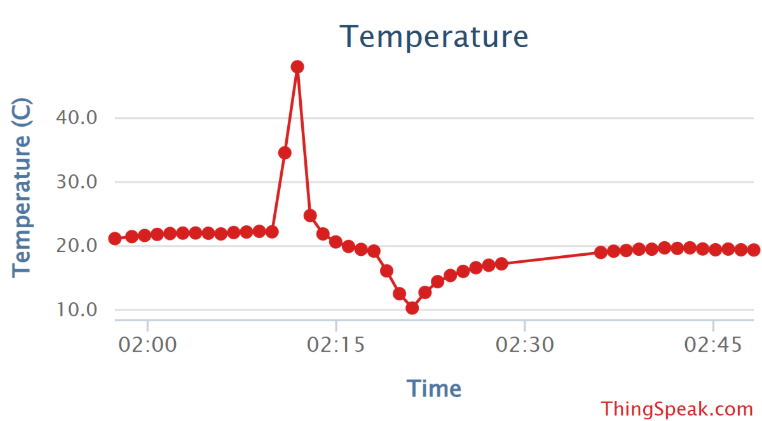

# CPE556 - IoT-based smart home monitoring system

## Overview :
This project is a bare-metal IoT system built on the B-U585I-IOT02A discovery kit that reads temperature data from an onboard sensor and uploads it to the 
ThingSpeak cloud platform for real-time monitoring, all implemented at the register level without HAL.

### What it does :
- Reads live temperature data from the onboard HTS221 sensor over I2C
- Connects to Wi-Fi using the onboard EMW3080 module over SPI
- Uploads sensor readings to ThingSpeak every 60 seconds via HTTP
- Outputs system status and debug information over UART (viewable in Tera Term)

### Setup :
1. Create a new project in Keil for the STM32U585AIIx
2. Copy the `Integration.c` code into your `main.c` file 
3. In the source file, replace the following placeholders with your own credentials:
    - `YOUR_SSID` — your Wi-Fi network name
    - `YOUR_PASSWORD` — your Wi-Fi password
    - `YOUR_API_KEY` — your ThingSpeak write API key
4. Build and flash to the board
5. Open Tera Term to monitor boot and connection status

## System Architecture
The system is built around the **B-U585I-IOT02A** discovery kit and organized into three main layers:

- The **HTS221** temperature sensor communicates with the STM32U5 over **I2C**
- The **EMW3080** Wi-Fi module connects to the internet over **SPI**
- All processing and cloud communication logic runs on the **STM32U5** chip in bare-metal C

## Results
During testing, the system successfully connected to Wi-Fi, obtained an IP via DHCP, and uploaded temperature readings to ThingSpeak at one-minute intervals.
A 10-minute live demo was conducted where a lighter was used to heat the sensor, and the temperature spike was clearly visible on the ThingSpeak dashboard.

**Demo Video:** [Watch on YouTube]([https://youtube.com/your-link-here](https://www.youtube.com/watch?v=3qEgXVXQWnU)) 
**Final Report:** [View Report](docs/CPE556_Final_Report.pdf)

## Team :
- Diego Giraldo Tabares
- Aliona Heitz
- Malvi Patel
